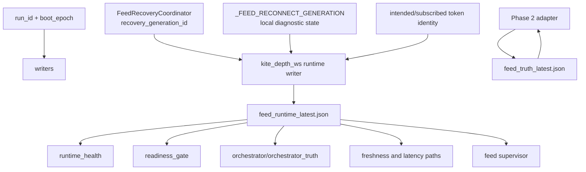

# PR813 feed currentness authority graph

Base: `e6195ce531b7f26777cd88ca18b0fff0c8bbdbe1`.



## Current authority facts

- `run_id + boot_epoch` is the existing runtime session authority.
- `recovery_generation_id` is independently owned by `FeedRecoveryCoordinator` and is copied into runtime artifacts.
- `_FEED_RECONNECT_GENERATION` is module-local, declared more than once, and has no complete invalidation lifecycle.
- `subscription_generation_id` is an evidence/hash identity for subscription state, not a governed top-level currentness authority.
- intended/subscribed token identity is a separate exact-set safety contract and must remain intact.
- `feed_runtime_latest.json` is consumed by health, readiness, orchestrator, Phase 2, freshness, and supervisor paths.
- `feed_truth_latest.json` is produced by `runtime_feed_truth_snapshot.py` but does not yet have equivalent enforced provenance.

## Required target graph

```text
run_id + boot_epoch
        +
authoritative feed_epoch
        ↓
canonical feed truth writer
        ↓ source hash/session/epoch
canonical runtime health writer
        ↓
one validated current-state loader
        ↓
runtime health / readiness / orchestrator / Phase 2 / freshness / supervisor
```

Diagnostic and evidence readers may retain raw access only when their output cannot alter feed health, readiness, candidate flow, or decisions.
