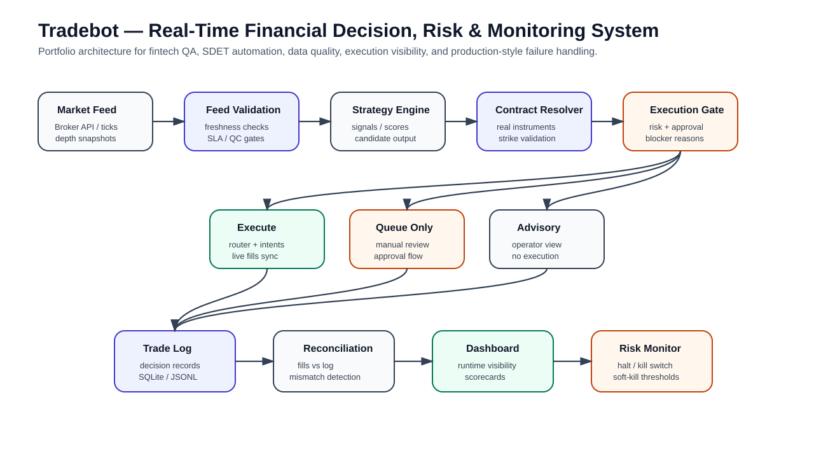
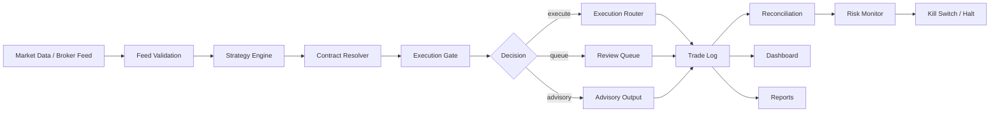

# Tradebot

[](https://github.com/ramgolladi1503-sys/tradebot/actions/workflows/ci.yml)
[](https://github.com/ramgolladi1503-sys/tradebot/actions/workflows/portfolio-ci.yml)

**Real-time financial decision, risk, and execution-monitoring system for options trading workflows.**

Tradebot is a production-style portfolio project for testing real-time fintech systems. It demonstrates market-data validation, contract resolution, signal processing, execution gating, risk controls, reconciliation, dashboarding, reporting, data governance, and automated health checks.

This repository should be read as a QA/SDET + fintech reliability project, not as a promise of trading profitability.

---

## Portfolio assets

- [Architecture image](docs/architecture/tradebot-architecture.svg)
- [Fintech QA one-pager](docs/one-pagers/fintech-qa-trading-systems.md)
- [TradeBot Evidence RAG scope](docs/rag/TRADEBOT_RAG_SCOPE.md)
- [TradeBot Evidence RAG operations](docs/rag/TRADEBOT_RAG_OPERATIONS_V1.md)
- [Test reports guide](docs/test-reports/README.md)
- [Branch protection policy](docs/BRANCH_PROTECTION.md)
- [Release checklist](docs/RELEASE_CHECKLIST.md)
- [Historical engineering log](docs/HISTORICAL_ENGINEERING_LOG.md)
- [Project chat evidence](docs/PROJECT_CHAT_EVIDENCE.md)
- LinkedIn: https://www.linkedin.com/in/ram-golladi

---

## CI and release gates

Tradebot protects `main` through PR-based development, CI checks, Portfolio CI, branch protection documentation, historical release evidence, project-chat evidence, and a release checklist for runtime-sensitive changes.

Required merge gates:

- `ci / unit_tests` — installs dependencies and runs the full pytest suite in paper/offline-safe mode.
- `ci / health_gate` — runs `python -m core.health_gate --desk DEFAULT --strict` and uploads health-gate artifacts on failure.
- `Portfolio CI / Documentation, architecture, runtime health, contract guard, stale feed, and portfolio quality gate` — validates portfolio docs and runs focused runtime-health, contract-resolution guard, and stale-feed simulator tests.

Before merging changes that touch market feed, contract resolution, execution gating, risk controls, dashboard persistence, broker/session handling, reconciliation, or operational scripts, review:

- [Branch protection policy](docs/BRANCH_PROTECTION.md)
- [Release checklist](docs/RELEASE_CHECKLIST.md)
- [Historical engineering log](docs/HISTORICAL_ENGINEERING_LOG.md)
- [Project chat evidence](docs/PROJECT_CHAT_EVIDENCE.md)

Trading-system rule: a change is not release-ready just because tests start. It must preserve the system's ability to explain whether a trade is executable, queue-only, advisory-only, or blocked.

---

## Architecture image



---

## Problem statement

Trading systems fail for reasons that simple demos never expose:

- Market data becomes stale.
- Strategy output does not map to a real tradable contract.
- Risk gates silently block execution.
- Broker auth expires.
- Dashboards show incomplete symbols.
- Logs disagree with execution state.
- Backtests do not match live runtime behavior.
- Operators cannot quickly explain why a trade was blocked.

Tradebot is built to make those failure modes visible, testable, and auditable.

---

## Architecture



---

## Core capabilities

### Market-data validation

- Kite auth/session checks.
- Feed self-tests without broker dependency.
- Depth websocket support.
- Tick and depth persistence in SQLite.
- Data QC and SLA checks.

### Contract resolution

- Maps strategy outputs to real broker instruments.
- Designed to catch contract-resolution failures before execution.
- Supports instrument download and validation flows.

### Execution lifecycle visibility

- Decision logging into SQLite.
- Manual approval flow.
- Execution intent logs.
- Live fills sync.
- Reconciliation of fills vs trade logs.

### Risk and safety controls

- Risk monitor.
- Resettable risk halt.
- Kill switch script.
- Soft-kill thresholds for daily PF, Sharpe, and performance-alert days.

### ML / RL experimentation scaffold

- Dataset building.
- Model training scripts.
- Walk-forward training.
- Tick-based training.
- RL stub and PPO/DDPG training entrypoints.

### Reporting and dashboarding

- Daily reports.
- Scorecards.
- Daily ops bundle.
- Streamlit dashboard.
- Execution analytics.

### Data governance

- Trade-log hashing.
- Data manifests.
- Dataset freezing.
- SQLite persistence for long-horizon labeling.

---

## Tech stack

- Python
- Pytest
- SQLite
- Streamlit
- Broker API integration patterns
- WebSocket feed patterns
- ML/RL experiment scaffolding
- Shell scripts for operations
- JSON/CSV logs
- Telegram/email reporting hooks

---

## Setup

Install dependencies:

```bash
pip install -r requirements.txt
```

After pulling changes, run the same command again to sync new dependencies.

Create a `.env` file using the provided template:

```bash
cp .env.example .env
```

Example `.env` values:

```env
KITE_API_KEY=your_kite_api_key
KITE_API_SECRET=your_kite_api_secret
KITE_ACCESS_TOKEN=your_kite_access_token
KITE_USE_API=true
KITE_TRADES_SYNC=true
KITE_INSTRUMENTS_TTL=3600
TERM_STRUCTURE_EXPIRY=WEEKLY

ENABLE_TELEGRAM=true
TELEGRAM_BOT_TOKEN=your_telegram_bot_token
TELEGRAM_CHAT_ID=your_telegram_chat_id

EMAIL_REPORTS=false
SMTP_HOST=
SMTP_PORT=587
SMTP_USER=
SMTP_PASSWORD=
SMTP_TO=
```

---

## Run locally

Start the live bot:

```bash
python main.py
```

Start the Streamlit dashboard:

```bash
streamlit run dashboard/streamlit_app.py
```

Depth websocket is optional:

```bash
python scripts/start_depth_ws.py
```

---

## TradeBot Evidence RAG

TradeBot includes a standalone, local, citation-first RAG application for querying repository engineering and research evidence. It is isolated from broker APIs, live market feeds, strategy execution, approval, and risk mutation.

The current implementation uses deterministic chunking and SQLite FTS5 retrieval with extractive answer synthesis. It does not call an LLM, embedding service, vector database, or external web source.

### Pull the current application

```bash
git checkout main
git pull origin main
```

Run all RAG commands from the repository root. The CLI imports repository modules through `PYTHONPATH=.`.

### What the RAG fetches and indexes

By default, the indexer reads only repository evidence from:

- `README.md`
- `docs/`
- `research/`

Supported source formats:

- Markdown: `.md`
- Text: `.txt`
- JSON: `.json`
- YAML: `.yaml`, `.yml`

The indexer records the source path, section, line range, content hash, and chunk text. Answers cite evidence using paths such as `docs/example.md:L10-L24`.

The RAG does not fetch or index broker data, live ticks, option chains, runtime databases, logs, models, `.env` files, credentials, secrets, imported external directories, or files outside this repository. It also excludes common generated directories such as `.git`, `.runtime`, virtual environments, caches, `node_modules`, `data`, `logs`, and `models`.

To explicitly select the allowed repository sources during a build:

```bash
PYTHONPATH=. python scripts/tradebot_rag.py build \
  --include README.md docs research
```

### Build or refresh the index

```bash
PYTHONPATH=. python scripts/tradebot_rag.py build
```

The local SQLite index is created at:

```text
.runtime/rag/tradebot_rag.sqlite
```

Builds are incremental. Re-run the build after `README.md`, `docs/`, or `research/` changes. Unchanged documents are not re-indexed. Supported CLI and Streamlit builds use an atomic lock so competing builds fail closed instead of modifying the index concurrently.

### Inspect index status and integrity

```bash
PYTHONPATH=. python scripts/tradebot_rag.py status
PYTHONPATH=. python scripts/tradebot_rag.py doctor
```

`status` reads index inventory without changing the database. `doctor` performs read-only checks for SQLite integrity, required tables, schema version, document/chunk reconciliation, orphan chunks, metadata counts, FTS row correspondence, foreign-key violations, and active build locks.

Run the deterministic retrieval and refusal evaluation:

```bash
PYTHONPATH=. python scripts/tradebot_rag.py evaluate
```

### Run the RAG web application

```bash
PYTHONPATH=. python -m streamlit run dashboard/tradebot_rag_app.py
```

Open the local URL printed by Streamlit, normally `http://localhost:8501`.

In the UI:

1. Select **Build / refresh index** if the index does not exist or repository evidence changed.
2. Select **Run integrity check** to verify the index.
3. Choose how many evidence chunks to retrieve.
4. Optionally limit retrieval to `docs`, `research`, or `README.md`.
5. Enter a question and select **Search evidence**.
6. Review the grounded answer, confidence, source paths, line ranges, and retrieved chunks.

Example questions:

```text
Why was the ORB hypothesis rejected?
What evidence supports the Market Event Graph direction?
Which strategy research campaigns concluded that no structural edge was found?
What failures were found in feed freshness recovery work?
```

### Query from the command line

```bash
PYTHONPATH=. python scripts/tradebot_rag.py query \
  "Why was the ORB hypothesis rejected?"
```

Return structured JSON:

```bash
PYTHONPATH=. python scripts/tradebot_rag.py query \
  "Why was the ORB hypothesis rejected?" \
  --json
```

Restrict retrieval to research evidence:

```bash
PYTHONPATH=. python scripts/tradebot_rag.py query \
  "Which structural-edge campaigns failed?" \
  --path-prefix research
```

Increase the retrieved evidence count:

```bash
PYTHONPATH=. python scripts/tradebot_rag.py query \
  "Explain the Market Event Graph evidence" \
  --top-k 12
```

Unsupported questions are refused when the repository does not contain sufficient evidence. A refusal is intentional and should not be bypassed by adding unsupported claims.

### RAG troubleshooting

- `ModuleNotFoundError`: run the command from the repository root and include `PYTHONPATH=.`.
- `streamlit: command not found`: install project dependencies or run `python -m pip install streamlit==1.37.1`.
- `Index not built`: run the build command or use **Build / refresh index** in the UI.
- `rag_build_in_progress`: another supported build owns the lock. Do not delete a fresh lock or a lock owned by a live same-host process.
- Failed `doctor`: retain the database for investigation, rebuild through the supported build command, and run `doctor` again. The doctor does not repair the index.
- Port `8501` already in use: add `--server.port 8502` to the Streamlit command.

Detailed contracts:

- [RAG production scope](docs/rag/TRADEBOT_RAG_SCOPE.md)
- [RAG index operations](docs/rag/TRADEBOT_RAG_OPERATIONS_V1.md)

---

## Operational commands

### Broker/session validation

```bash
python scripts/check_kite_auth.py
python scripts/validate_kite_session.py
python scripts/generate_kite_access_token.py
python scripts/generate_kite_access_token.py --update-env
```

### Instrument data

```bash
python scripts/download_instruments.py
python scripts/fetch_upstox_instruments.py --url <upstox_instruments_url>
```

### Manual approval

```bash
python scripts/approve_trade.py <trade_id>
```

### Backtest

```bash
python core/run_backtest.py
```

### Testing

```bash
pytest -q
./scripts/run_tests.sh
```

### Deterministic offline health gate

```bash
python -m core.health_gate --desk DEFAULT --strict
```

Outputs:

- `logs_dir()/events.jsonl`
- `logs_dir()/recon.json`
- `logs_dir()/health_gate_report.json`
- `logs_dir()/health_gate_report.md`

See: [Test reports guide](docs/test-reports/README.md)

---

## ML and data workflows

### Build, train, and evaluate

```bash
python models/build_ml_dataset.py
python models/train_live_model.py
python models/train_deep_model.py
python models/train_micro_model.py
python models/walk_forward_train.py
```

### Register and activate model

```bash
python models/train_live_model.py --register
python scripts/activate_model.py --type xgb --path models/xgb_live_model.pkl
```

### Tick-based training

```bash
python models/train_from_ticks.py --out data/tick_features.csv
python models/train_from_ticks.py --from-depth --depth-tolerance-sec 2 --train-micro
python scripts/audit_market_data.py
```

### RL scaffold

```bash
python rl/train_stub.py
python rl/train_ppo.py
python rl/train_ddpg.py
python rl/train_validate_rl.py
```

---

## Trade outcome labeling

```bash
python scripts/update_trade_outcome.py <trade_id> <exit_price> [actual(1/0)]
python scripts/export_trade_log_csv.py
```

Strategy performance tracking persists in:

```text
logs/strategy_perf.json
```

---

## Reporting and governance

```bash
python scripts/daily_report.py
python scripts/update_scorecard.py
python scripts/daily_scorecard.py
python scripts/run_execution_analytics.py
python scripts/hash_trade_log.py
python scripts/data_manifest.py
python scripts/freeze_dataset.py
python scripts/daily_ops.py
python scripts/data_qc.py
python scripts/sla_check.py
python scripts/daily_rollup.py
python scripts/reconcile_fills.py
```

Live fills sync:

```bash
python scripts/live_fills_sync.py
```

Execution router live intent log:

```bash
cat logs/execution_intents.jsonl
```

---

## Test strategy

### Unit tests

- Contract resolution.
- Feed validation.
- Gating logic.
- Risk controls.
- Decision normalization.
- Persistence helpers.

### Integration tests

- Strategy output to contract resolver.
- Resolver to execution gate.
- Decision persistence to dashboard.
- Trade log to reconciliation.
- Broker/session validation with safe mocks.

### Offline deterministic checks

- `core.health_gate` validates system health without real broker/network dependency.
- Useful for CI and pre-live readiness.

### Data quality tests

- Stale LTP detection.
- Missing symbol/strike detection.
- Tick/depth dataset audit.
- SLA checks.

### Runtime safety tests

- Risk halt.
- Kill switch.
- Manual approval.
- Non-executable decision states.

---

## Failure modes handled

- Broker session/auth failure.
- Missing or stale market data.
- Stale option LTP.
- Contract-resolution failure.
- Strategy emits a signal that cannot be safely executed.
- Risk gate blocks trade.
- Manual approval required.
- No trades generated due to missing trained model or unavailable market data.
- Dashboard rendering issues caused by missing runtime fields.
- Reconciliation mismatch between fills and trade log.
- Underperforming strategy auto-disable workflow.

---

## Screenshots / demo

- Screenshots: architecture image added.
- Demo video: not recorded yet.

Planned recruiter demo:

1. Run offline health gate.
2. Show generated health report.
3. Run sample trades/dashboard data.
4. Show execution states: executable, queue-only, advisory-only, blocked.
5. Show stale-data and contract-resolution failure handling.
6. Show risk monitor and reconciliation outputs.

---

## Roadmap

### Phase 1 — Portfolio hardening

- Add architecture screenshots.
- Add demo dataset.
- Add CI workflow for tests and health gate.
- Add sample dashboard screenshots.
- Add recruiter demo video.

### Phase 2 — Testing depth

- Expand unit coverage for resolver/gating/risk.
- Add golden-file tests for decision logs.
- Add contract tests for dashboard data schema.
- Add deterministic stale-feed simulations.

### Phase 3 — Runtime reliability

- Improve feed failover behavior.
- Add richer observability events.
- Add incident reports.
- Add operator runbook.
- Add stricter reconciliation gates.

---

## Portfolio value

This repo demonstrates how I approach QA/SDET work for real-time fintech systems: reliability, observability, failure handling, data correctness, risk controls, automated checks, and production-style debugging.

---

## Troubleshooting

- Missing env vars warning: ensure `.env` exists and required variables are filled.
- `ModuleNotFoundError`: run `pip install -r requirements.txt`.
- No trades generated: check market data availability, model training state, contract resolution, and gate blockers.
- Dashboard mismatch: verify runtime logs and persisted decision fields before assuming a frontend issue.
