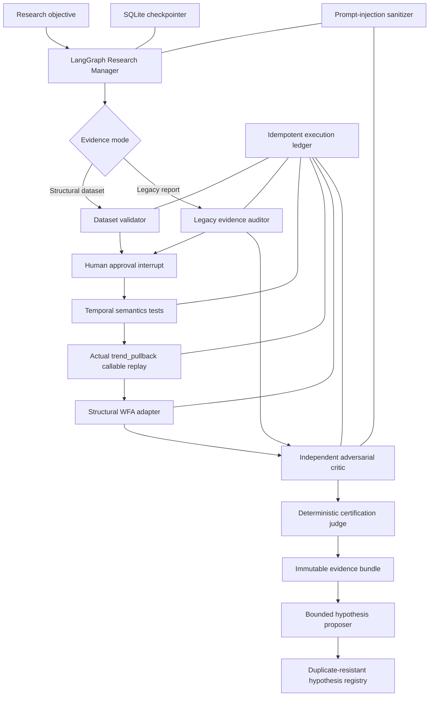

# Architecture

## Authority separation

| Component | May reason | May calculate metrics | May mutate production | May certify |
| --- | --- | --- | --- | --- |
| Research Manager | Yes | No | No | No |
| Independent Critic | Yes | No | No | No |
| TradeBot tools | No | Yes | No | No |
| Deterministic Judge | Rule evaluation only | Uses tool outputs | No | Yes |
| Human reviewer | Approve/reject plan | No | No through this system | No override of judge |

## Sidecar boundary

Every implementation file lives under `agentic_research/`. The sidecar imports selected deterministic TradeBot research callables but exposes no reverse dependency into the production runtime.
