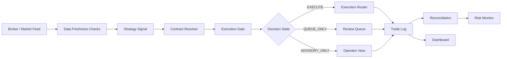

# Real-Time Financial Trading & Risk Monitoring Platform

## Positioning

A portfolio-grade fintech QA/SDET project demonstrating how to test and monitor real-time trading workflows: market data, contract resolution, execution states, risk gates, reconciliation, dashboarding, and failure handling.

This is positioned as a reliability and testing project, not a profitability claim.

---

## Problem

Financial trading systems are fragile because failures happen across multiple layers at once:

- Market data can become stale.
- Strategy output may not map to a real contract.
- Broker sessions can expire.
- Risk gates can block execution.
- Dashboards can hide missing fields.
- Logs and fills can drift apart.
- Operators may not know why a candidate was blocked.

The project makes those failures visible and testable.

---

## Architecture

---

## What it demonstrates

### Market data validation

- Feed self-test.
- Stale LTP detection.
- Depth snapshots.
- Tick storage.
- Market data audit scripts.

### Contract resolution

- Maps strategy output to broker instruments.
- Detects zero-executable-symbol conditions.
- Prevents fake execution when a valid contract cannot be resolved.

### Risk gates

- Execution gate.
- Manual approval.
- Risk halt.
- Kill switch.
- Performance-based soft kill.

### Execution lifecycle

- Candidate creation.
- Decision logging.
- Execution intent logs.
- Live fills sync.
- Trade outcome labeling.
- Reconciliation.

### Dashboard and reporting

- Streamlit dashboard.
- Daily reports.
- Scorecards.
- Execution analytics.
- Health gate reports.

### Test automation

- Pytest unit tests.
- Offline deterministic health gate.
- Data QC checks.
- SLA checks.
- Reconciliation checks.

---

## Failure scenarios covered

- Broker auth/session failure.
- Stale market feed.
- Stale option LTP.
- Contract-resolution failure.
- Missing strike/symbol metadata.
- Risk gate blocks execution.
- Manual approval required.
- No model trained.
- Dashboard receives missing fields.
- Fill log does not reconcile with trade log.

---

## Tech stack

Python, Pytest, SQLite, Streamlit, WebSocket feed patterns, broker API integration patterns, JSON/CSV logs, shell automation, ML experiment scaffolding, data-quality scripts.

---

## Recruiter summary

This project proves I can test and debug real-time fintech systems where correctness, observability, data quality, and safe execution matter more than simple UI automation.

Target roles:

- Fintech QA Engineer
- SDET
- Backend QA Engineer
- API Automation Engineer
- Trading Platform QA Engineer
- Production QA / Reliability QA Engineer
