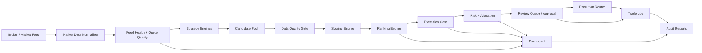

# ARCHITECTURE.md

# Aixion Quant Console / Tradebot Architecture

**Status:** Target architecture for opportunity-engine MVP and elite build  
**Owner:** Ram  
**Last updated:** 2026-05-12

---

## 1. Architecture goal

The architecture must separate raw strategy output from executable opportunity truth.

Current weak pattern:

```text
strategy -> trade builder -> emit rows -> dashboard filter
```

Target pattern:

```text
market data -> strategies -> candidate pool -> data-quality gate -> scoring engine -> ranking engine -> execution gate -> risk layer -> dashboard/audit
```

The dashboard is only a reader of truth. It must not become the hidden decision engine.

---

## 2. High-level system flow



---

## 3. Layer responsibilities

### 3.1 Market data normalizer

Normalizes broker quotes, ticks, option depth, and instrument data.

Outputs:

```text
symbol
instrument_token
ltp
bid
ask
spread
volume
oi
quote_timestamp
source
```

Must not hide missing values. Missing data is product truth.

### 3.2 Feed health layer

Computes feed state once per cycle and exposes it everywhere.

Outputs:

```text
feed_status
ws_connected
quote_age_ms
subscribed_tokens_count
stale_reason
last_tick_epoch
```

Rule:

```text
readiness, execution gate, dashboard, and reports must consume the same feed-health object
```

### 3.3 Strategy engines

Generate raw candidates. They do not decide final execution.

Output contract:

```text
raw_candidate
raw_confidence
strategy_family
signal_reason
direction
symbol
strike
expiry
option_type
```

### 3.4 Candidate pool

Collects and normalizes candidates from all strategies.

Responsibilities:

- Deduplicate candidates.
- Preserve strategy source.
- Preserve raw signal reason.
- Assign candidate lifecycle.
- Prevent direct UI emission.

### 3.5 Data-quality gate

Classifies trustworthiness.

Hard demotions:

```text
fallback_used -> ADVISORY_ONLY
stale_ltp -> BLOCKED
missing_contract -> BLOCKED
wide_spread -> QUEUE_ONLY or BLOCKED
```

### 3.6 Scoring engine

Scores candidates using deterministic components before ML complexity is added.

Core score components:

```text
strategy_edge_score
momentum_score
liquidity_score
spread_score
volatility_score
regime_fit_score
data_quality_score
time_decay_score
```

Output:

```text
opportunity_score
score_breakdown
score_confidence
score_warning
```

### 3.7 Ranking engine

Sorts candidates and produces product-facing buckets.

Buckets:

```text
TOP_OPPORTUNITY
EXECUTABLE_NOW
WATCHLIST
ADVISORY_ONLY
BLOCKED
```

Responsibilities:

- Enforce score separation.
- Avoid correlated duplicates dominating top results.
- Surface score compression.
- Track rank changes.

### 3.8 Execution gate

Final safety gate before approval/execution.

Hard blockers:

```text
fallback_quote
stale_option_ltp
missing_contract_token
risk_halt
spread_too_wide
missing_stop_loss
missing_target
```

Output:

```text
execution_allowed
execution_status
primary_blocker
blocker_details
```

### 3.9 Risk and allocation layer

Adds position sizing and risk budget.

Output:

```text
position_size
capital_allocation_pct
max_loss
stop_loss
target
risk_reward
exposure_group
```

### 3.10 Dashboard

Displays ranked truth.

Required sections:

1. System health.
2. Top opportunities.
3. Executable now.
4. Watchlist.
5. Advisory-only.
6. Blocked.
7. Debug candidate table.
8. Audit trail.

---

## 4. Data contracts

### 4.1 Candidate schema

```text
candidate_id: string
created_at: datetime
symbol: string
instrument: string
option_type: CE|PE
strike: number
expiry: date
direction: BUY|SELL|NONE
strategy_family: string
source_strategy: string
raw_confidence: float
raw_reason: string
candidate_status: string
```

### 4.2 Scored candidate schema

```text
candidate_id
opportunity_score
score_breakdown
score_warning
rank
rank_bucket
score_delta_from_top
```

### 4.3 Execution readiness schema

```text
candidate_id
execution_allowed
execution_status
primary_blocker
blocker_details
fallback_used
quote_valid
contract_valid
risk_valid
```

### 4.4 Dashboard row schema

```text
rank
symbol
instrument
direction
score
candidate_status
execution_status
primary_reason
primary_blocker
position_size
stop_loss
target
data_quality_status
```

---

## 5. Critical invariants

```text
fallback_used == true -> execution_allowed == false
quote_valid == false -> execution_allowed == false
contract_valid == false -> execution_allowed == false
risk_halt_active == true -> execution_allowed == false
```

Any code path violating these is a P0 architecture bug.

---

## 6. Persistence architecture

Persist these artifacts:

```text
candidate_pool_snapshot.jsonl
ranking_snapshot.jsonl
execution_readiness_snapshot.jsonl
risk_snapshot.jsonl
feed_health_snapshot.jsonl
decision_audit.jsonl
```

Dashboard should read these or equivalent runtime artifacts instead of recomputing final decisions.

---

## 7. Testing architecture

Minimum layers:

- Unit tests for each score component.
- Contract tests for candidate schema.
- Invariant tests for execution gate.
- Dashboard row-model tests.
- Release-validation tests.
- Health-gate integration.

---

## 8. Architecture anti-patterns

Forbidden:

- Strategy directly marks executable.
- UI recomputes final execution truth.
- Fallback quote becomes executable.
- Missing token is patched silently.
- Score is a single opaque confidence field.
- Debug table becomes the main product.
- Filters substitute for ranking.

---

## 9. Elite architecture extensions

After MVP:

- Regime-aware dynamic weights.
- Portfolio correlation clustering.
- Adaptive sizing.
- Paper/live drift detector.
- Opportunity outcome labeling.
- Model-assisted ranking only after deterministic truth is stable.
- Operator replay mode.

---

## 10. Architecture north star

The architecture is good only if the product can answer:

```text
Why this trade?
Why now?
Why this size?
Why not the others?
What data proves it?
What blocks execution?
```

If it cannot answer those, the architecture is not finished.
